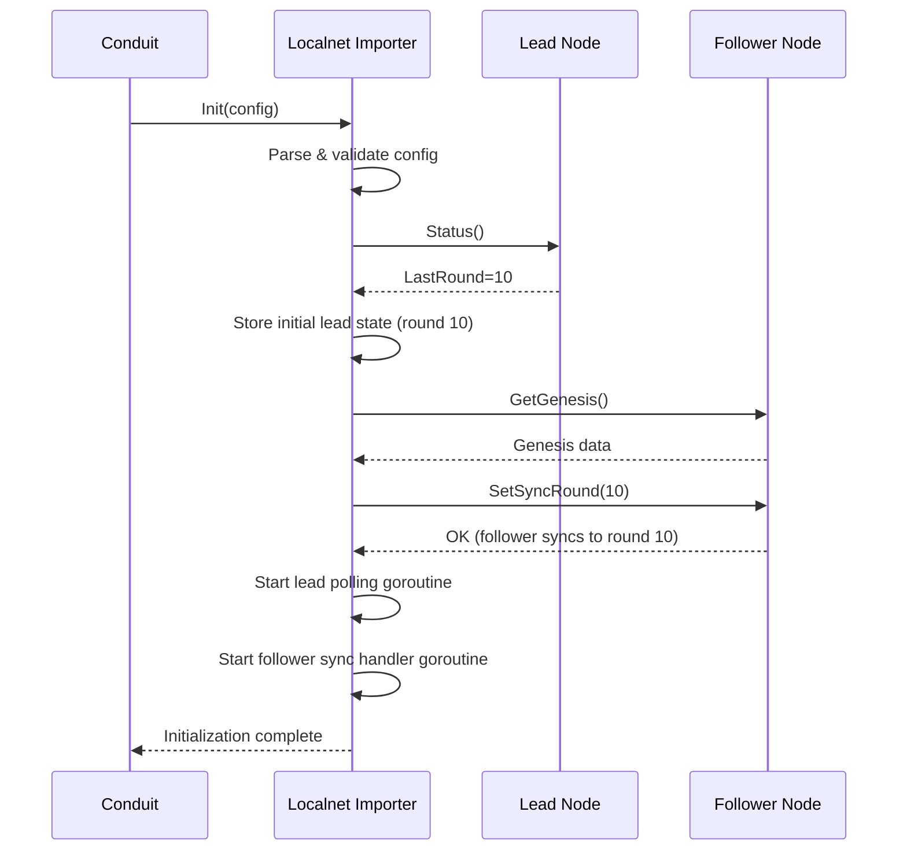
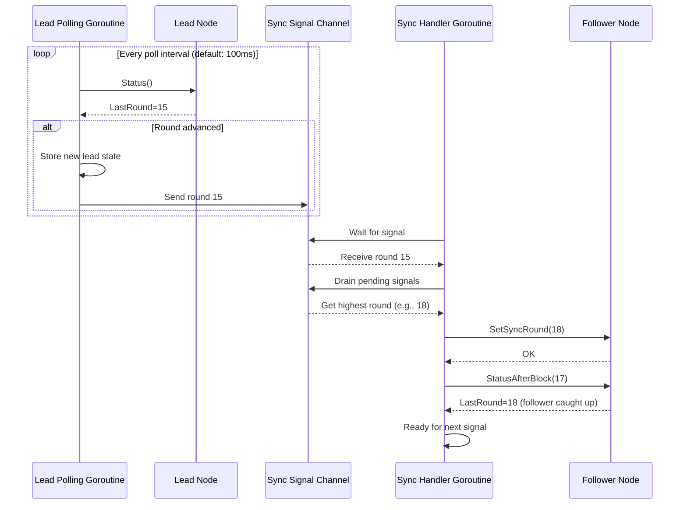
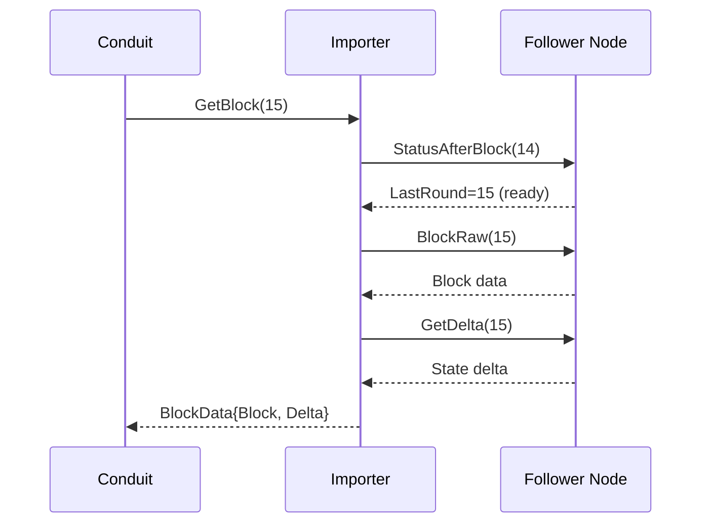
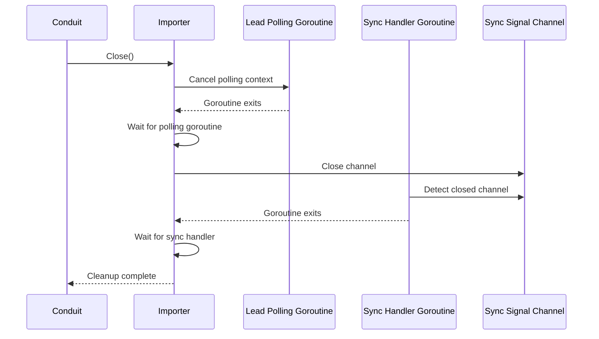

# Conduit Localnet Importer

A standalone [Conduit](https://github.com/algorand/conduit) importer plugin optimized for localnet performance using lead-based synchronization.

## Overview

This plugin provides a specialized importer for Algorand localnet environments that uses a "follow the leader" approach:
* **Lead-based sync**: Continuously polls a lead (primary) algod node and automatically syncs a follower node to match
* **Optimized for localnet**: Designed specifically for high-performance localnet environments where the included algod importer hits performance challenges.
* **Follower mode only**: Operates exclusively in follower mode with state deltas

## How It Works

The localnet importer uses a dual-goroutine architecture to keep the follower node synchronized with the lead node.

### Initialization Flow



### Continuous Synchronization

The importer runs two background goroutines that work together to keep the follower synchronized:



### Block Retrieval

When Conduit requests a block, the importer fetches it from the follower node:



### Shutdown Flow



## Building

### From Source

Build with: `make conduit`

This places the `conduit` binary at the project root.

Verify that your plugin is listed in the resulting binary: `./conduit list`

### With Docker

#### Using Docker Compose (Recommended)

1. Copy the example configuration:
```bash
cp conduit.yml.example conduit.yml
```

2. Edit `conduit.yml` with your lead and follower node URLs and tokens.

3. Start the service:
```bash
docker-compose up -d
```

4. View logs:
```bash
docker-compose logs -f conduit
```

5. Stop the service:
```bash
docker-compose down
```

#### Using Docker Run

Build the image:
```bash
docker build -t conduit-localnet:latest .
```

Run the container:
```bash
docker run -d \
  --name conduit-localnet \
  -p 8980:8980 \
  -v $(pwd)/conduit.yml:/etc/algorand/conduit.yml:ro \
  -v conduit-data:/data \
  conduit-localnet:latest
```

#### Connecting to Host Services

To access Algorand nodes running on your host machine:

- **macOS/Windows**: Use `host.docker.internal` in your config
- **Linux**: Add `--add-host=host.docker.internal:host-gateway` to docker run

Example configuration for nodes on host:
```yaml
importer:
  name: localnet_importer
  config:
    lead-node-url: "http://host.docker.internal:8080"
    follower-node-url: "http://host.docker.internal:8081"
    token: "your-token"
```

## Configuration

The localnet importer requires two algod nodes:
1. **Lead node**: The primary node that generates blocks
2. **Follower node**: A follower-mode node that syncs to the lead

### Required Configuration

- `lead-node-url`: URL of the **lead** algod node (e.g., `http://localhost:8080`)
- `follower-node-url`: URL of the **follower** algod node (e.g., `http://localhost:8081`)

### Token Configuration

At least one token must be provided. You have three options:

1. **Use same token for both nodes** (simplest):
   - Set `token`: Used for both lead and follower nodes

2. **Use separate tokens**:
   - Set `follower-node-token`: Used for follower node
   - Set `lead-node-token`: Used for lead node

3. **Mix of default and specific**:
   - Set `token` as default
   - Optionally override with `follower-node-token` and/or `lead-node-token`

### Optional Configuration

- `lead-node-poll-interval`: How often to poll the lead node (default: 100ms)
- `wait-for-round-timeout`: Max time to wait for follower to reach a round (default: 5s)

### Example Configuration

Initialize conduit with the localnet importer:
```bash
./conduit init --importer localnet_importer -d conduit_data
```

Edit `conduit_data/conduit.yml` and configure the importer section:
```yaml
importer:
  name: localnet_importer
  config:
    lead-node-url: "http://localhost:8080"  # Lead node
    follower-node-url: "http://localhost:8081"  # Follower node
    token: "your-default-token"  # Default token for both nodes
    # follower-node-token: "your-follower-token"  # Optional, overrides token for follower
    # lead-node-token: "your-lead-token"  # Optional, overrides token for lead
```

Start conduit:
```bash
./conduit -d conduit_data
```

## Development

The main plugin implementation is in `plugin/importer/importer.go`. Key components:

### Architecture

1. **Lead Node Polling Goroutine** (`startLeadNodePolling`):
   - Polls the lead node at regular intervals (default: 100ms)
   - Detects when the lead advances to a new round
   - Sends sync signals to the follower sync handler via a buffered channel

2. **Follower Sync Handler Goroutine** (`startFollowerSyncHandler`):
   - Receives sync signals from the polling goroutine
   - Drains the signal channel to always sync to the highest round
   - Calls `SetSyncRound` to tell the follower which round to sync to
   - Waits for the follower to reach the target round before processing next signal

3. **Synchronization**:
   - Uses atomic operations for thread-safe lead state tracking
   - Buffered channel prevents polling goroutine from blocking
   - Only one `SetSyncRound` call active at a time

### Testing

Run tests with: `make test`

Format code with: `make fmt`

For more details on Conduit plugin development, see the [Conduit Development](https://github.com/algorand/conduit/blob/master/docs/Development.md) documentation.

## Release

This release process has limited support. Please create an issue if you experience problems.

Goreleaser can be configured with `make release`. It is setup to cross compile for multiple platforms and create multi-architecture Docker images.
