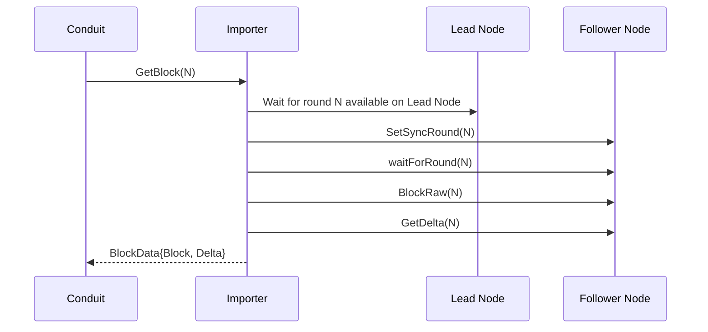
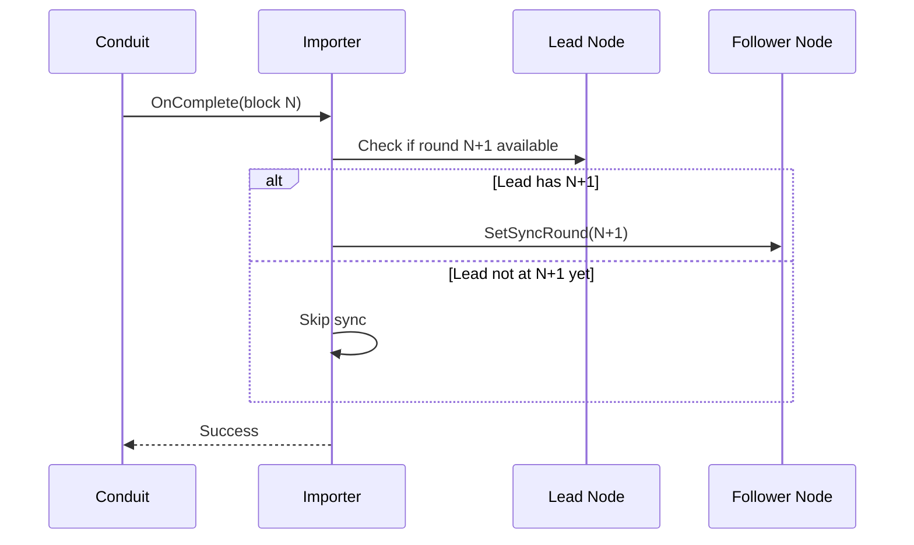

# Conduit Localnet Importer

A standalone [Conduit](https://github.com/algorand/conduit) importer plugin optimized for localnet performance using lead-based synchronization.

## Overview

This plugin provides a specialized importer for Algorand localnet environments that uses a "follow the leader" approach:
* **Lead-based sync**: Continuously polls a lead (primary) algod node to track block production
* **Optimized for localnet**: Designed for high-performance localnet environments
* **Follower mode only**: Operates exclusively in follower mode with state deltas enabled

## How It Works

The importer coordinates a lead node (producing blocks) and a follower node (serving Conduit):

### GetBlock Flow



### OnComplete Flow



## Configuration

The localnet importer requires two algod nodes:
1. **Lead node**: The primary node that generates blocks
2. **Follower node**: A follower-mode node that syncs to the lead

### Required Configuration

- `lead-node-url`: URL of the lead algod node (e.g., `http://localhost:8080`)
- `follower-node-url`: URL of the follower algod node (e.g., `http://localhost:8081`)

### Token Configuration

At least one token must be provided. You have three options:

1. **Use same token for both nodes** (simplest):
   - Set `token`: Used for both lead and follower nodes

2. **Use separate tokens**:
   - Set `follower-node-token`: Used for follower node
   - Set `lead-node-token`: Used for lead node

3. **Mix of default and specific**:
   - Set `token` as default
   - Optionally override with `follower-node-token` and/or `lead-node-token`

### Optional Configuration

- `lead-node-poll-interval`: How often to poll the lead node for status (default: 100ms, max: 60s)
- `wait-for-round-timeout`: Max time to wait for lead to reach a round (default: 0 = no timeout)
- `lead-node-startup-timeout`: Max time to wait for lead node connection during Init (default: 5s, max: 30s, 0 = skip check)

### Example Configuration

Initialize conduit with the localnet importer:
```bash
./conduit init --importer localnet_importer -d conduit_data
```

Edit `conduit_data/conduit.yml` and configure the importer section:
```yaml
importer:
  name: localnet_importer
  config:
    lead-node-url: "http://localhost:8080"
    follower-node-url: "http://localhost:8081"
    token: "your-default-token"
    # Optional configuration:
    # lead-node-poll-interval: "100ms"
    # wait-for-round-timeout: "0s"
    # lead-node-startup-timeout: "5s"
```

Start conduit:
```bash
./conduit -d conduit_data
```
